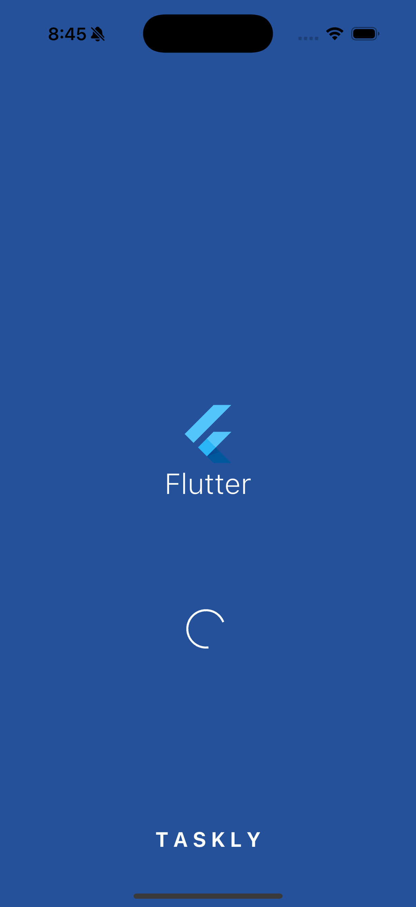
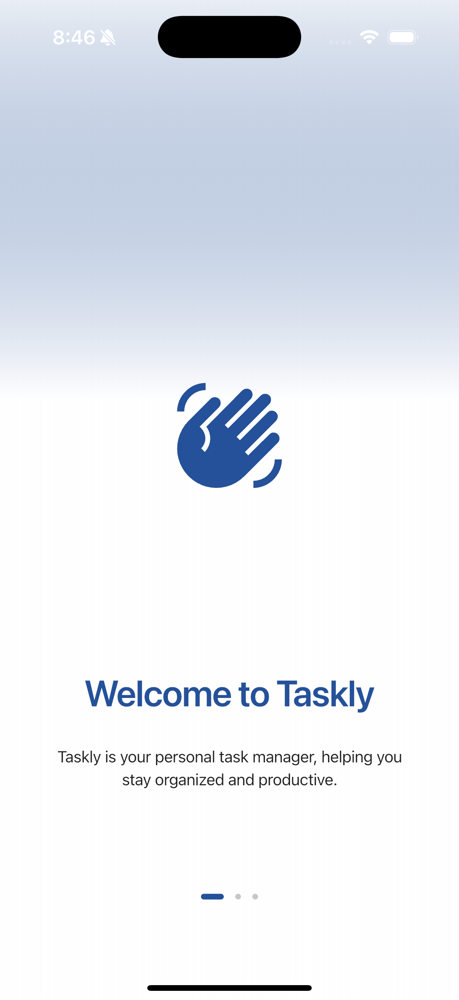
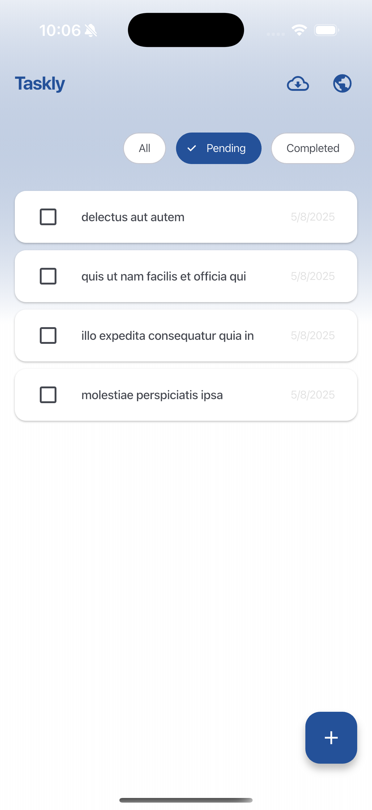
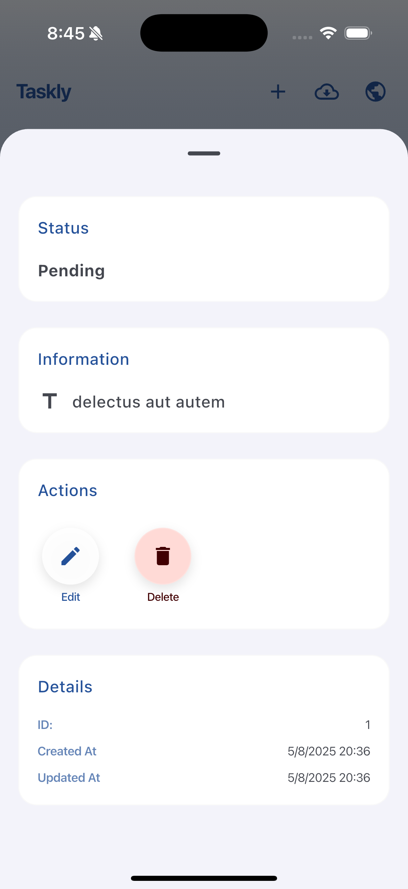
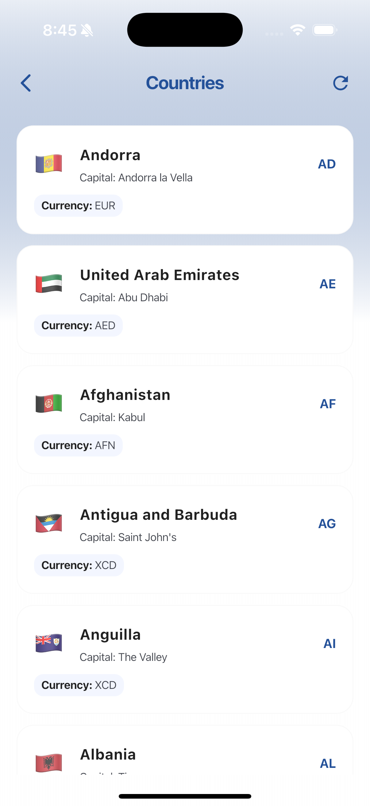
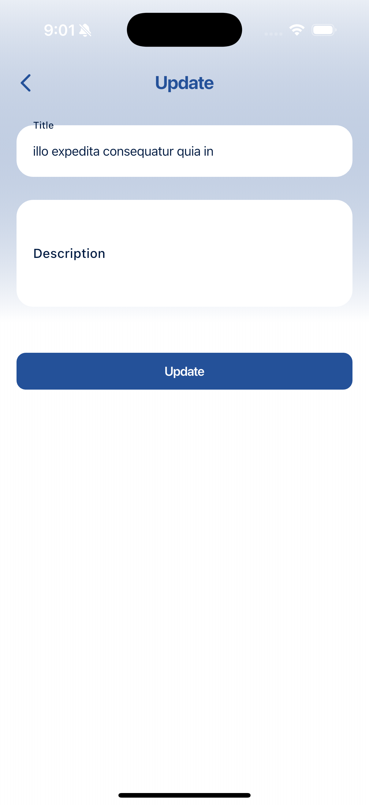

# Taskly

> Taskly is an app created to show my abilities as Flutter developer.

[](https://pub.dev/packages/badges)
[](https://flutter.dev)
[](https://dart.dev)
[](https://pub.dev/packages/flutter_lints)

## Table of Contents
- [Taskly](#taskly)
  - [Table of Contents](#table-of-contents)
  - [Screenshots](#screenshots)
  - [Features](#features)
  - [Tech stack](#tech-stack)
  - [App architecture](#app-architecture)
  - [API Endpoints](#api-endpoints)
  - [Getting started](#getting-started)
  - [Testing](#testing)

## Screenshots

<div align="center">
  
  
  
</div>

<div align="center">
  
  
  
</div>

## Features
- **Splash screen**: A splash screen that appears when the app is launched.
- **Onboarding**: A simple onboarding flow to introduce the app.
- **Home screen**: Displays a list of tasks with options to add, edit, and import from cloud using the Typicode API.
- **Task details**: View and manage individual tasks with details.
- **Add task**: A screen to add a new task with details.
- **Update task**: A screen to update the details of a task.
- **Countries**: A screen to display a list of countries.

## Tech stack
- **Flutter**: The framework used for building the app.
- **Dart**: The programming language used for development.
- **Riverpod**: State management solution for managing app state.
- **Dio**: For making HTTP requests to the Typicode API.
- **Drift & Sqflite**: For local database management.
- **GraphQL Flutter**: For GraphQL queries.
- **Slang**: For localization and internationalization.
- **Flutter test**: For unit and widget testing.

## App architecture
The app follows a clean architecture pattern with the following layers:
- **Presentation**: Contains the UI components and state management using Riverpod.
- **Domain**: Contains the business logic and use cases.
- **Data**: Contains the data sources, repositories, and models.

Additionally, the app uses a micro packages structure to separate concerns and improve maintainability, which includes:
- **taskly_ui**: Contains the shared UI components and widgets.
- **taskly_commons_dependencies_dev**: Contains common dependencies used across the app.
- **taskly_api_client**: Contains the API client for making HTTP requests.
- **taskly_graphql**: Contains the GraphQL client and queries.

And can be located in the `packages` directory.

## API Endpoints
- **REST API**: [JSONPlaceholder](https://jsonplaceholder.typicode.com)
- **GraphQL**: [Countries GraphQL API](https://countries.trevorblades.com)

## Getting started

To get started with Taskly, follow these steps:

1. Clone the repository:
   ```bash
   git clone https://github.com/krrskl/taskly.git
   ```

2. Install the dependencies:
   ```bash
   cd taskly

   cd packages/taskly_ui
   flutter pub get

   cd ../taskly_commons_dependencies_dev
   flutter pub get

   cd ../taskly_api_client
   flutter pub get

   cd ../taskly_graphql
   flutter pub get

   cd ..
   flutter pub get
   ```

3. Define the environment variables in a `env.dev.json` file at the root of the project following the structure of `env.example.json`.
4. Run the app:
   ```bash
   flutter run
   ```

## Testing
To run the tests, use the following command:
```bash
flutter test
```
The app includes unit tests for the business logic and widget tests for the UI components. The tests can be found in the `test` directory.

> Made with ❤️ by [krrskl](https://github.com/krrskl)